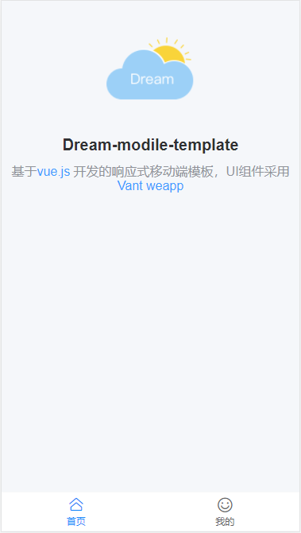

<p align="center">
    
    <p align="center" style="font-size:25px;font-weight: bold;color:#409EFF">Dream-vue-cli</p>
</p>

<p align="center">
  
  <a href="https://github.com/vuejs/vue">
    
  </a>
  
  
  
</p>

---
#### 项目介绍
> Dream-vue-cli脚手架可以下载，指定基于vue2实现的移动端响应式模板

#### 模板目录结构
```
│  .browserslistrc
│  .eslintignore
│  .eslintrc.js
│  .gitignore
│  babel.config.js
│  package-lock.json
│  package.json
│  README.md
│  vue.config.js
│  
│      
├─public
│      back.gif
│      favicon.ico
│      index.html
│      
└─src
    │  App.vue
    │  main.js
    │  
    ├─api
    ├─assets
    │      header.jpg
    │      logo.png
    │      
    ├─components
    ├─router
    │      index.js
    │      
    ├─store
    │      index.js
    │      
    ├─styles
    │      blendent.scss
    │      init.scss
    │      remCalculate.scss
    │      
    ├─utlis
    │  │  http.js
    │  │  init.js
    │  │  jsToken.js
    │  │  websiteUrl.js
    │  │  
    │  └─Vant
    │          index.js
    │          
    └─views
        ├─home
        │      index.vue
        │      
        ├─person
        │      index.vue
        │      list.vue
        │      
        └─taberNavigation
            │  index.vue
            │  
            └─components
                    navBar.vue
                    taber.vue
```
#### 项目展示
<div style="display: flex;">
  
  
</div>

#### 使用方法
```
1.npm install
2.npm run serve
```

